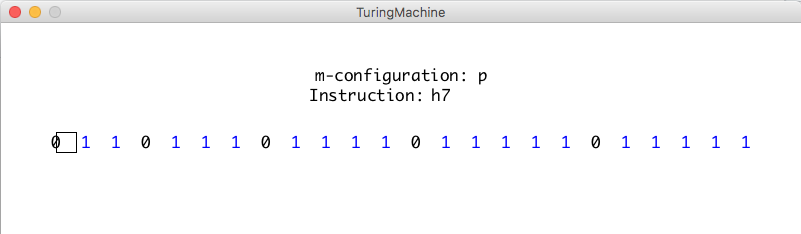

# TuringMachine

A visualisation I made in January 2015 of a state machine calculating the square root of 2.

This implementation is described in the Charles Petzold book *The Annotated Turing*, which explores Turing's paper *On Computable Numbers*.

The code is not particularly readable unfortunately. I've learned my lessons.

## Installation

Download and install Processing from http://www.processing.org.

## References

Charles Petzold, The Annotated Turing
